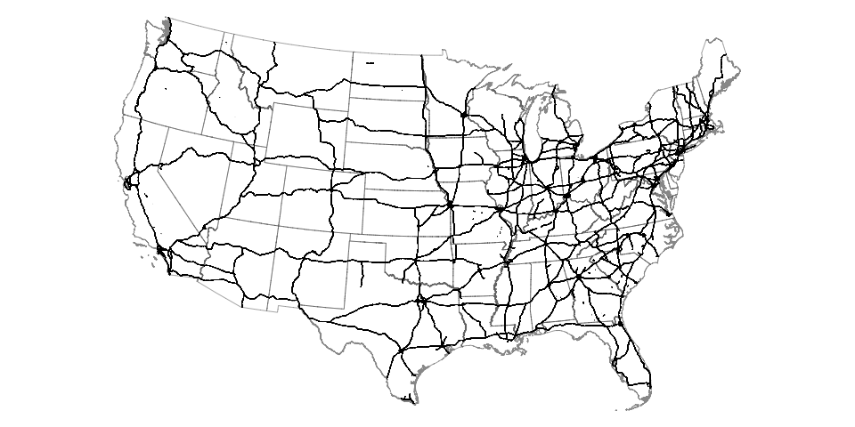

# roads <a href='https://degauss.org'></a>

[](https://github.com/degauss-org/roads/releases)
[](https://github.com/degauss-org/roads/actions/workflows/build-deploy-release.yaml)

## Using

If `my_address_file_geocoded.csv` is a file in the current working directory with coordinate columns named `lat` and `lon`, then the [DeGAUSS command](https://degauss.org/using_degauss.html#DeGAUSS_Commands):

```sh
docker run --rm -v $PWD:/tmp ghcr.io/degauss-org/roads:0.2.1 my_address_file_geocoded.csv
```

will produce `my_address_file_geocoded_roads_0.2.1_400m_buffer.csv` with added columns:

- **`dist_to_1100`**: distance (meters) to the nearest S1100 road
- **`dist_to_1200`**: distance (meters) to the nearest S1200 road
- **`length_1100`**: length (meters) of S1100 roads within a 400 m buffer
- **`length_1200`**: length (meters) of S1200 roads within a 400 m buffer

### Optional Argument

The default buffer radius for length of roads is 400 meters, but can be changed by supplying an optional argument to the degauss command. For example, 

```sh
docker run --rm -v $PWD:/tmp ghcr.io/degauss-org/roads:0.2.1 my_address_file_geocoded.csv 800
```

will produce `my_address_file_geocoded_roads_0.2.1_800m_buffer.csv`, and `length_1100` and `length_1200` will be the lengths within an 800 m buffer.

## Geomarker Methods

This container uses 2018 S1100 and S1200 roads, as defined by the U.S. Census Bureau.

| Road Type | Road Type Code | General Description | U.S. Census Definition | 
|:---:|:----:|:----:| :----: |
| Primary | S1100 | interstates and freeways | generally divided, limited-access highways within the Federal interstate highway system or under state management; distinguished by the presence of interchanges and are accessible by ramps and may include some toll highways | 
| Secondary | S1200 | arterial roads and state highways | main arteries, usually in the U.S. highway, state highway, or county highway system; have one or more lanes of traffic in each direction, may or may not be divided, and usually have at-grade intersections with many other roads and driveways | 

The map below shows all features defined as "S1100" in the MAF/TIGER database.



## Geomarker Data

- 2018 S1100 roadway shapefiles were downloaded using [`tigris`](https://github.com/walkerke/tigris). 

- 2018 S1200 roadway shapefiles were downloaded directed from the [U.S. Census Bureau](ftp://ftp2.census.gov/geo/tiger/TIGER2018/ROADS/) using the bash script in this repository.

- Road shapefiles are stored at [`s3://geomarker/geometries/roads1100_sf_5072.rds`](https://geomarker.s3.us-east-2.amazonaws.com/geomarker/geometries/roads1100_sf_5072.rds) and [`s3://geomarker/geometries/roads1200_sf_5072.rds`](https://geomarker.s3.us-east-2.amazonaws.com/geomarker/geometries/roads1200_sf_5072.rds)

## DeGAUSS Details

For detailed documentation on DeGAUSS, including general usage and installation, please see the [DeGAUSS homepage](https://degauss.org).
