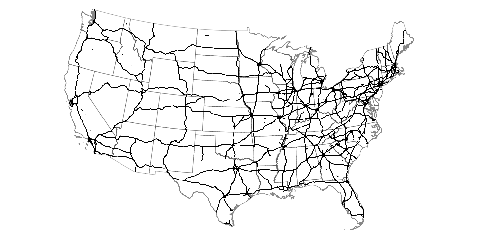

# degauss/roads <a href='https://degauss-org.github.io/DeGAUSS/'></a>

> DeGAUSS container that calculates distance to nearest roadway and length of roadways within buffer for S1100 and S1200 roadways for PEPR multi-site study

[](https://hub.docker.com/repository/docker/degauss/roads/tags)
[](https://github.com/degauss-org/roads/releases)

## DeGAUSS example call

```sh
docker run --rm -v "$PWD":/tmp degauss/roads:0.1 my_address_file_geocoded.csv 
```

Optionally, change the default buffer radius:

```sh
docker run --rm -v "$PWD":/tmp degauss/roads:0.1 my_address_file_geocoded.csv --buffer_radius 500
```

## geomarker methods

## Primary (S1100) and Secondary (S1200) Roadways

The U.S. Census Bureau defines primary (S1100) roadways as "generally divided, limited-access highways within the Federal interstate highway system or under state management" and "distinguished by the presence of interchanges and are accessible by ramps and may include some toll highways". The map below shows all features defined as "S1100" in the MAF/TIGER database. 



Secondary (S1200) roads are described as "main arteries, usually in the U.S. highway, state highway, or county highway system" and "have one or more lanes of traffic in each direction, may or may not be divided, and usually have at-grade intersections with many other roads and driveways".

This container returns the distance to the nearest primary road and the distance to the nearest secondary road for each geocoded address, as well as the total length of primary roads and the total length of secondary roads within a buffer (defaults to 400 m) around each address. 

## geomarker data

S1100 roadway shapefiles were downloaded from [tigris](https://github.com/walkerke/tigris). S1200 roadway shapefiles were downloaded directed from the [U.S. Census Bureau](ftp://ftp2.census.gov/geo/tiger/TIGER2018/ROADS/) using the bash script in this repository.

Download the roadway shapefiles needed to build this container:

[https://s3.amazonaws.com/geomarker/roads/roads1100_sp_5072.rds](https://geomarker.s3.us-east-2.amazonaws.com/roads/roads1100_sp_5072.rds)

[https://s3.amazonaws.com/geomarker/roads/roads1200_sp_5072.rds](https://geomarker.s3.us-east-2.amazonaws.com/roads/roads1200_sp_5072.rds)


## DeGAUSS details

For detailed documentation on DeGAUSS, including general usage and installation, please see the [DeGAUSS README](https://github.com/degauss-org/DeGAUSS).

